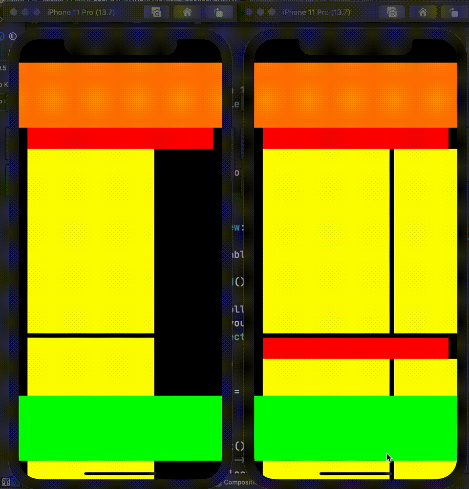

# Feedback FB8722886

Sample project for Apple Feedback number FB8722886, UICollectionViewCompositionalLayout: Pinned boundary supplementary items disappear when layout contains sections with orthogonal scrolling.

## Update (2021-06-08)

iOS 15 beta 1 seems to fix the dissappearing items however the `zIndex` of the layout items appear incorrect. The layout items (orange view) appear below the section items (red view).


[iOS 15 beta 1 behaviour video](compositional_bug_ios15.mov).

When turning off othogonol scrolling the correct behaviour is observed.


[iOS 15 beta 1 without orthogonal video](compositional_bug_no_orthogonal.mp4).

## Details

When using UICollectionView compositional layout I’m trying to pin global headers using `pinToVisibleBounds = true` for boundary items. This does not work as expected when the layout has a section that has `section.orthogonalScrollingBehavior = .continuous`. The global boundary items disappear as you scroll down (see sample project and video).

When not using the orthogonal scrolling the pinned global headers correctly stay on screen while scrolling in the collection view.

The documentation suggest this should work: 
`UICollectionViewCompositionalLayoutConfiguration`

`boundarySupplementaryItems`:
An array of the supplementary items that are associated with the boundary edges of the entire layout, such as global headers and footers.

## Example

* Yellow - Cells
* Red - Section header
* Orange - Global header
* Green - Global footer

Left simulator is using compositional layout. Header/footer remains visible at all times.

Right simulator is using compositional layout with sections that are configured with orthogonal scrolling. Notice the header and the global orange header and the global green footer disappears while scrolling.

[Full resolution video of bug](compositional_bug.mov).



## Work around for iOS 14

```swift
// In the cell:

/// Feedback: FB8722886
    /// https://github.com/gspiers/FB8722886
    /// Compositional Layout has a bug where global boundary supplementary views that have `pinToVisibleBounds=true` disappear if any of the section use orthogonal behavior.
    /// The layout itself does calculate layout attributes, but the UICollectionView stops applying them in `layoutSubviews` once the `maxY` of the supplementary view would have scrolled off the screen.
    /// See `FixStickyHeaderCollectionView` for other side of this workaround.
    /// We apply these two attributes here to keep this header sticky as the super call above does not apply them after scrolling down a little bit.
    override public func apply(_ layoutAttributes: UICollectionViewLayoutAttributes) {
        super.apply(layoutAttributes)

        // Always apply frame and isHidden ourselves (see comment above).
        frame = layoutAttributes.frame
        layer.isHidden = layoutAttributes.isHidden
    }


// Use this UICollectionView subclass

/// Feedback: FB8722886
/// https://github.com/gspiers/FB8722886
/// Compositional Layout has a bug where global boundary supplementary views that have `pinToVisibleBounds=true` disappear if any of the section use orthogonal behavior.
/// The layout itself does calculate layout attributes, but the UICollectionView stops applying them in `layoutSubviews` once the `maxY` of the supplementary view would have scrolled off the screen.
/// We get the layout attributes for the header and apply them ourselves to the header view.
@available(iOS 13.0, *)
private class FixStickyHeaderCollectionView: UICollectionView {
    override func layoutSubviews() {
        super.layoutSubviews()

        let attributes = collectionViewLayout.layoutAttributesForSupplementaryView(ofKind: ViewAllCategoriesHeaderReusableView.supplementaryViewKind, at: IndexPath(indexes: [0]))

        let firstLayoutHeader = subviews.first { $0 is ViewAllCategoriesHeaderReusableView }

        // Even if UIKit fixes this we should only be applying the attributes twice in the worse case.
        if let reuseableView = firstLayoutHeader as? UICollectionReusableView, let attributes = attributes {
            reuseableView.apply(attributes)
        }
    }
}
```


